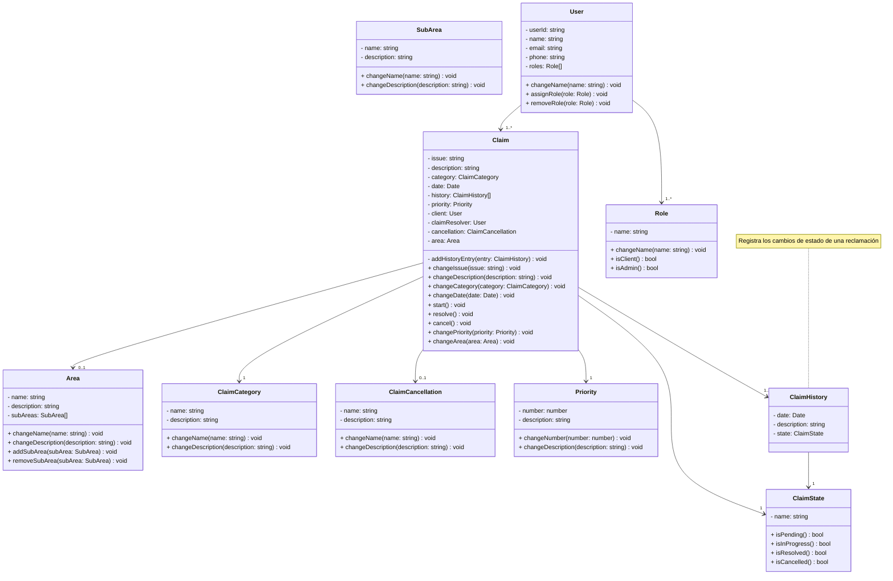

# Documentación

## Diagrama de Clases

```mermaid
classDiagram

class Claim {
  - issue: string
  - description: string
  - category: ClaimCategory
  - date: Date
  - history: ClaimHistory[]
  - priority: Priority
  - client: User
  - claimResolver: User
  - cancellation: ClaimCancellation
  - area: Area
  - addHistoryEntry(entry: ClaimHistory) void
  + changeIssue(issue: string) void
  + changeDescription(description: string) void
  + changeCategory(category: ClaimCategory) void
  + changeDate(date: Date) void
  + start() void
  + resolve() void
  + cancel() void
  + changePriority(priority: Priority) void
  + changeArea(area: Area) void
}

class ClaimCancellation {
  - name: string
  - description: string
  + changeName(name: string) void
  + changeDescription(description: string) void
}

class Priority {
  - number: number
  - description: string
  + changeNumber(number: number) void
  + changeDescription(description: string) void
}

class Area {
  - name: string
  - description: string
  - subAreas: SubArea[]
  + changeName(name: string) void
  + changeDescription(description: string) void
  + addSubArea(subArea: SubArea) void
  + removeSubArea(subArea: SubArea) void
}

class SubArea {
  - name: string
  - description: string
  + changeName(name: string) void
  + changeDescription(description: string) void
}

class ClaimCategory {
  - name: string
  - description: string
  + changeName(name: string) void
  + changeDescription(description: string) void
}

class ClaimState {
  - name: string
  + isPending() bool
  + isInProgress() bool
  + isResolved() bool
  + isCancelled() bool
}

class ClaimHistory {
  - date: Date
  - description: string
  - state: ClaimState
}

class Role {
  - name: string
  + changeName(name: string) void
  + isClient() bool
  + isAdmin() bool
}

class User {
  - userId: string
  - name: string
  - email: string
  - phone: string
  - roles: Role[]
  + changeName(name: string) void
  + assignRole(role: Role) void
  + removeRole(role: Role) void
}

Claim --> "1..*" ClaimHistory
Claim --> "1" ClaimState

User --> "1..*" Role
User --> "1..*" Claim

ClaimHistory --> "1" ClaimState
Claim --> "1" Priority
Claim --> "0..1" ClaimCancellation
Claim --> "1" ClaimCategory
Claim --> "0..1" Area

note for ClaimHistory "Registra los cambios de estado de una reclamación"
```
