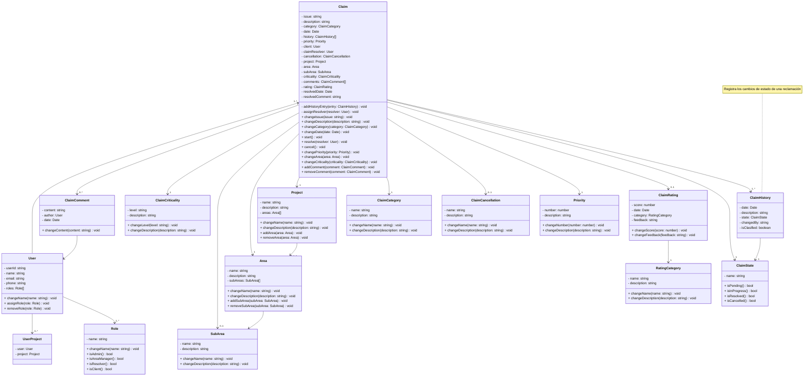

# Documentación

## Diagrama de Clases

## Notas de negocio, alcance y testing

### Reglas de negocio principales

- AreaManager: puede administrar reclamos en sus áreas y sub-áreas (asignar resolvers, cambiar sub-área, transferir entre áreas, cambiar prioridad/criticidad). Estas reglas están aplicadas en los casos de uso:
  - `AssignResolver` (src/module/tickets/application/useCases/assign-resolver.use-case.ts)
  - `AssignSubArea` (src/module/tickets/application/useCases/assign-subarea.use-case.ts)
  - `TransferArea` (src/module/tickets/application/useCases/transfer-area.use-case.ts)
- Resolver: solo puede ejecutar acciones operativas sobre reclamos de su área (iniciar, resolver, cancelar). Los métodos de dominio relevantes residen en `Claim` (start, resolve, cancel).
- Cliente: puede crear y editar su reclamo; en edición sólo puede cambiar descripción y área (política aplicada en `UpdateClaim`).
- `operatorId`: se propaga a los mutadores del agregado `Claim` y se registra en `ClaimHistory` para auditoría.

### Áreas que requieren revisión / lógicas incompletas

- Validación de alcance de `Resolver`: actualmente la autorización de resolver está soportada por `AssignResolver` y por comprobaciones de `UserArea`, pero conviene auditar todos los endpoints que cambian estado para asegurarse de que solo los resolvers autorizados pueden hacerlo.
- CRUD de SubAreas: los controladores y casos de uso existen (`CreateSubArea`, `UpdateSubArea`, etc.), pero conviene verificar en producción que apliquen la restricción "AreaManager gestiona sus sub-areas" en todos los flujos.
- Propagación de `operatorId`: la mayoría de mutadores aceptan `operatorId`, sin embargo revisar los controladores para asegurarse de que siempre pasan `user.id` desde `@UserFromRequest()`.

### Cobertura de testing y próximos pasos

- Ya hay pruebas unitarias amplias (47 suites, 169 tests en la sesión reciente). Añadí factories de roles en `test/shared/helpers/role-fakes.ts` para estandarizar mocks de roles.
- Falta aumentar cobertura de integración end-to-end para flujos clave:
  - Crear reclamo → asignar resolver → iniciar → resolver → calificar
  - Transferencia entre áreas y verificación de auditoría (`ClaimHistory.operatorId`)
  - Casos de error (permiso denegado) en endpoints reales (integración de controladores + servicios)

Recomendación: añadir 3-4 tests de integración que recorran los flujos anteriores usando providers de prueba (mocks/DB en memoria o repositorios fake) para garantizar reglas de negocio end-to-end.
