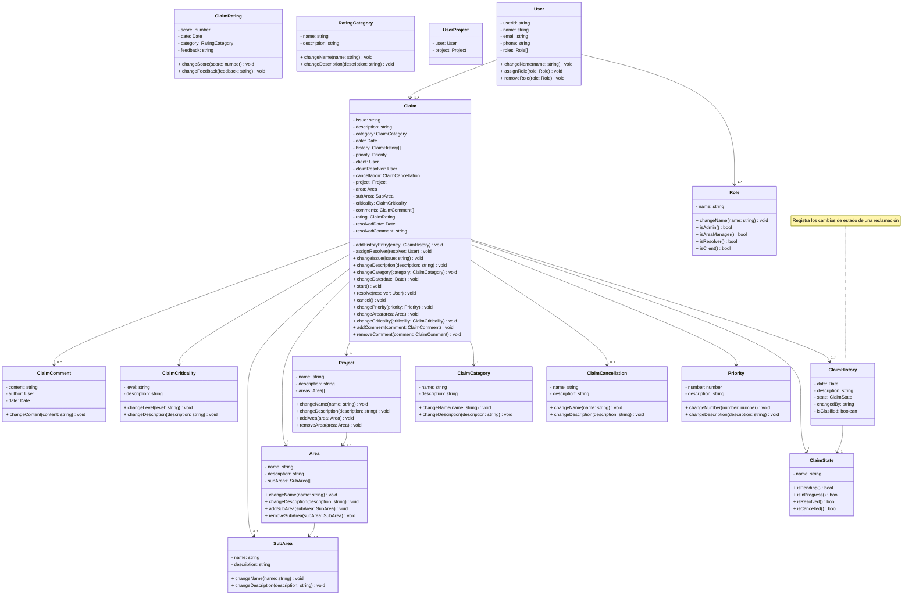

# Documentación

## Diagrama de Clases

```mermaid
classDiagram

class Claim {
  - issue: string
  - description: string
  - category: ClaimCategory
  - date: Date
  - history: ClaimHistory[]
  - priority: Priority
  - client: User
  - claimResolver: User
  - cancellation: ClaimCancellation
  - project: Project
  - area: Area
  - subArea: SubArea
  - criticality: ClaimCriticality
  - comments: ClaimComment[]
  - rating: ClaimRating
  - resolvedDate: Date
  - resolvedComment: string
  - addHistoryEntry(entry: ClaimHistory) void
  - assignResolver(resolver: User) void
  + changeIssue(issue: string) void
  + changeDescription(description: string) void
  + changeCategory(category: ClaimCategory) void
  + changeDate(date: Date) void
  + start() void
  + resolve(resolver: User) void
  + cancel() void
  + changePriority(priority: Priority) void
  + changeArea(area: Area) void
  + changeCriticality(criticality: ClaimCriticality) void
  + addComment(comment: ClaimComment) void
  + removeComment(comment: ClaimComment) void
}

class ClaimCriticality {
  - level: string
  - description: string
  + changeLevel(level: string) void
  + changeDescription(description: string) void
}

class ClaimComment {
  - content: string
  - author: User
  - date: Date
  + changeContent(content: string) void
}

class ClaimRating {
  - score: number
  - date: Date
  - category: RatingCategory
  - feedback: string
  + changeScore(score: number) void
  + changeFeedback(feedback: string) void
}

class RatingCategory {
  - name: string
  - description: string
  + changeName(name: string) void
  + changeDescription(description: string) void
}

class ClaimCancellation {
  - name: string
  - description: string
  + changeName(name: string) void
  + changeDescription(description: string) void
}

class Priority {
  - number: number
  - description: string
  + changeNumber(number: number) void
  + changeDescription(description: string) void
}

class Project {
  - name: string
  - description: string
  - areas: Area[]
  + changeName(name: string) void
  + changeDescription(description: string) void
  + addArea(area: Area) void
  + removeArea(area: Area) void
}

class UserProject {
  - user: User
  - project: Project
}

class Area {
  - name: string
  - description: string
  - subAreas: SubArea[]
  + changeName(name: string) void
  + changeDescription(description: string) void
  + addSubArea(subArea: SubArea) void
  + removeSubArea(subArea: SubArea) void
}

class SubArea {
  - name: string
  - description: string
  + changeName(name: string) void
  + changeDescription(description: string) void
}

class ClaimCategory {
  - name: string
  - description: string
  + changeName(name: string) void
  + changeDescription(description: string) void
}

class ClaimState {
  - name: string
  + isPending() bool
  + isInProgress() bool
  + isResolved() bool
  + isCancelled() bool
}

class ClaimHistory {
  - date: Date
  - description: string
  - state: ClaimState
  - changedBy: string
  - isClasified: boolean
}

class Role {
  - name: string
  + changeName(name: string) void
  + isAdmin() bool
  + isAreaManager() bool
  + isResolver() bool
  + isClient() bool
}

class User {
  - userId: string
  - name: string
  - email: string
  - phone: string
  - roles: Role[]
  + changeName(name: string) void
  + assignRole(role: Role) void
  + removeRole(role: Role) void
}

Claim --> "1..*" ClaimHistory
Claim --> "1" ClaimState

User --> "1..*" Role
User --> "1..*" Claim

ClaimHistory --> "1" ClaimState
Claim --> "1" Priority
Claim --> "0..1" ClaimCancellation
Claim --> "1" ClaimCategory
Claim --> "1" Project
Claim --> "1" Area
Claim --> "0..1" SubArea
Claim --> "1" ClaimCriticality
Claim --> "0..*" ClaimComment

Area --> "0..*" SubArea
Project --> "1..*" Area


note for ClaimHistory "Registra los cambios de estado de una reclamación"
```
